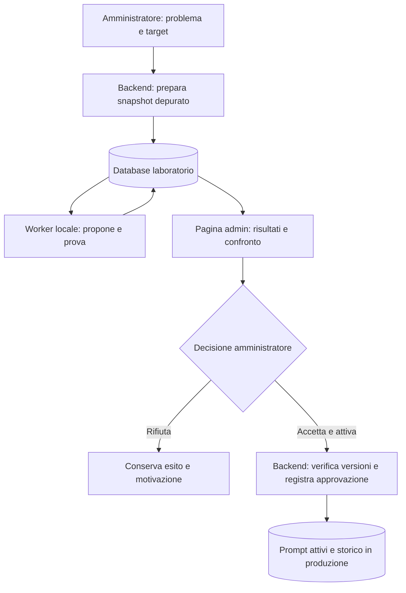

# Laboratorio di miglioramento dei prompt con approvazione amministrativa

**Stato**: pilota locale implementato; replay completo e copertura per l’attivazione ancora da completare.
**Aggiornamento**: 2026-09-10.
**Perimetro**: backend, ambiente di test isolato e pagina di amministrazione.
**Autorizzazione di questa sessione**: sviluppo richiesto dall’utente dopo il piano;
sottotask con Claude Code e Claude Code–DeepSeek. Prove di rilascio su casi sintetici,
nessuna importazione di dati personali né attivazione di prompt operativi.

**Implementazione e uso**: [guida del pilota](../operations/prompt-lab.md). Il laboratorio
è disponibile in amministrazione con modelli e obiettivi selezionabili. Le condizioni
di attivazione restano bloccanti: l’attuale replay sintetico non copre persona, skill,
retrieval e contesti personali. La prima prova locale ha completato quattro casi con
dieci chiamate; revisioni e ricevute sono verificate su PostgreSQL di test.

Questo documento sostituisce il piano del 2026-09-08. La richiesta del
2026-09-10 introduce l'approvazione preventiva: l'AI propone e sperimenta,
l'amministratore decide se attivare. L'applicazione automatica, il rollback
automatico e il cron delle 04:00 del vecchio piano non fanno parte del nuovo
percorso. Il nome del file resta invariato per conservare i collegamenti.

## 1. Risultato atteso e confini

Un amministratore deve poter leggere il problema, vedere la modifica esatta,
confrontare le risposte ottenute e accettare o rifiutare con piena tracciabilità.
Una proposta non cambia mai il comportamento delle conversazioni reali prima
dell'accettazione. Il miglioramento riguarda il testo dei prompt, non
l'addestramento dei pesi del modello.

| Decisione | Prima versione |
|---|---|
| Avvio | Manuale, dalla pagina amministrativa |
| Origine | Problema rilevato dal sistema oppure obiettivi specifici scritti dall'amministratore |
| Finalità | Verificare come rispondono i modelli oppure proporre e valutare un miglioramento del prompt |
| Target | Un solo `guided_step` QSA per esperimento, scelto da una lista ammessa |
| Varianti | Al massimo due nella finalità di miglioramento, immutabili dopo l'avvio delle prove |
| Modelli | Scelti nell'interfaccia per ruolo: preparazione prove, proposta di modifiche, valutazione; uno o più modelli da testare. Tutti locali, senza fallback esterno |
| Ambiente | Worker e database del laboratorio separati dalla produzione |
| Valutazione | Controlli di codice, giudice calibrato e revisione umana delle risposte |
| Attivazione | Solo mediante «Accetta e attiva» da parte di un amministratore |
| Ripristino | Manuale, versionato e protetto contro modifiche successive |
| Automazione successiva | Raccolta dei problemi e avvio programmato, sempre con approvazione preventiva |

Restano fuori dalla prima versione: modifica di prompt globali o personalità,
Bussola, IDEA, modifica del giudice o delle rubriche da parte del proponente,
prove A/B sugli studenti, auto-apply e fine-tuning. L'estensione a un altro
strumento richiede casi e controlli coerenti con quello strumento.

L'unità della prima prova è un turno con storia congelata. Una prova su un
turno non dimostra la qualità di un'intera conversazione: prima di estendere
il laboratorio a sintesi o percorsi completi serviranno scenari con più turni.

## 2. Componenti esistenti verificati e limiti del riuso

| Componente | Riuso previsto | Limite da rispettare |
|---|---|---|
| `backend/chat_preparation.py` | Preparazione condivisa di chat sincrona, streaming e audit | Va alimentata con snapshot isolati; identificare gli accessi a DB, memoria e skill |
| `backend/prompt_audit.py` | Envelope e controlli di lingua, fattori e formato | Il dry-run non esegue retrieval/skill; il live audit scrive log. Non è già un laboratorio isolato |
| `backend/thread_guard.py` | Rubrica, struttura del verdetto e parsing | `evaluate()` chiama `store()`, che committa log e può chiudere domande. Non chiamarlo sulle sessioni reali durante un test |
| `backend/ai_service.py` | Chiamate ai modelli locali e gestione delle risposte | Configurazione del laboratorio esplicita; non ereditare credenziali o fallback di produzione |
| `backend/prompt_revisions.py` | Storico, scrittura del testo attivo e ripristino | La modifica accettata deve avere `origin="admin"` per mantenere la protezione dalle migrazioni |
| `backend/prompt_updates.py` | Blocco della riga e verifica dell'hash prima della scrittura | `apply_plan()` committa internamente: il nuovo servizio deve includere anche la ricevuta di approvazione nella stessa transazione |
| `frontend/src/components/admin/PromptHistory.tsx` | Consultazione dello storico e collegamento alla revisione | Non contiene il confronto degli esperimenti |
| `frontend/src/components/admin/BenchmarkPanel.tsx` | Convenzioni per avvio, stato e dettaglio delle prove | Il benchmark attuale confronta modelli su uno scenario QSA fisso; non confronta revisioni dei prompt reali |

I prompt attivi sono valori nel database; i file `backend/prompts/` e i default
in `prompt_config.py` coprono installazioni nuove e fallback. L'attivazione
amministrativa aggiorna il valore nel database. Un eventuale consolidamento
nei default sarà una modifica di codice distinta, revisionata e testata.

## 3. Architettura e confine dell'ambiente di test

### Separazione concreta

- Servizio Compose dedicato al worker e istanza PostgreSQL del laboratorio,
  con credenziali e volume propri. Non riusare `counselorbot_test`: le suite
  automatiche potrebbero azzerarne o modificarne i dati.
- Il worker riceve soltanto snapshot, configurazione locale ammessa e accesso
  al DB laboratorio. Nessun accesso al DB di produzione, al socket Docker,
  ai volumi di sessioni/upload o alle credenziali dell'applicazione.
- L'uscita di rete consente soltanto il database del laboratorio e gli endpoint
  locali ammessi. Verificare anche DNS, redirect e indisponibilità del modello:
  la sola etichetta del provider non garantisce che una richiesta resti locale.
- Il backend amministrativo è il punto di collegamento: esporta i dati ammessi,
  legge i risultati e gestisce l'attivazione. Il worker non possiede un token
  che possa chiamare l'API amministrativa di attivazione.
- Il caricamento di snapshot importa solo le tabelle/strutture necessarie alla
  prova, tramite un elenco esplicito di campi ammessi. Campi sconosciuti fanno
  fallire l'importazione. Nessuna copia integrale del database di produzione.
- Il worker gira senza privilegi root, con limiti CPU/RAM. Gli snapshot e i
  manifest congelati non sono modificabili dal suo ruolo DB; risultati e
  varianti già congelati sono immutabili anche nello storage. I modelli ricevono
  payload testuali senza strumenti per interrogare database o eseguire comandi.

Le generazioni usano un job persistente con un solo worker e una sola prova
attiva inizialmente. Limiti pilota: due varianti, 60 minuti e 240 chiamate
complessive, includendo giudizi e tentativi ripetuti. Sono tetti di risorse,
non una promessa di durata o adeguatezza del campione. La concorrenza locale
iniziale è uno; l'admin può interrompere il job.

Alla scadenza del budget o dopo un arresto, conservare i risultati parziali e
chiudere la run come incompleta. Un processo riavviato riconosce un job rimasto
`running` senza worker e lo chiude come interrotto; il riavvio delle prove crea
una nuova run. Nessuna ripartenza infinita o continuazione invisibile.

## 4. Dati, attribuzione del problema e riproducibilità

### Casi e provenienza

Per il primo esperimento l'amministratore sceglie un problema e casi pertinenti,
comprendendo fallimenti e risposte già riuscite. I verdetti del thread guard
sono indizi, non dimostrazioni che la causa sia il prompt. Un problema dovuto a
retrieval assente, errore applicativo o limite del modello non autorizza una
riscrittura compensativa.

Il feedback umano resta distinto dal verdetto automatico. Un voto negativo non
spiega da solo la causa; un disaccordo resta visibile e non viene scartato per
far aumentare il punteggio. Non attribuire `StrategyFeedback` a un singolo turno
tramite la sola coppia strumento/fase. Usare collegamenti certi; se mancano,
conservare il segnale solo a livello aggregato.

### Obiettivi specifici dell'amministratore

L'amministratore può avviare un esperimento senza attendere un errore rilevato
dal sistema. Scrive uno o più obiettivi, indica quello principale e aggiunge
eventuali vincoli da preservare. Esempi: «Non chiedere di nuovo informazioni già
presenti nella storia», «Concludere con al massimo una domanda focalizzata»,
«Accorciare la risposta mantenendo corretti i significati dei fattori».

Ogni obiettivo registra testo originale, ambito, priorità, comportamento atteso,
criterio osservabile e casi che lo mettono alla prova. L'AI può aiutare a
trasformare l'obiettivo in casi e criteri, ma l'amministratore li rivede prima
dell'avvio. Un obiettivo generico come «rispondere meglio» resta una bozza finché
non viene precisato; obiettivi incompatibili devono essere risolti prima del test.
I vincoli del dominio restano controlli obbligatori anche se non sono citati
nell'obiettivo. I risultati vengono mostrati per obiettivo e per modello.

Il laboratorio offre due finalità esplicite:

- **Verifica delle risposte**: usa il prompt attuale sui modelli selezionati e
  valuta gli obiettivi; non genera varianti né presenta un'azione di attivazione.
- **Miglioramento del prompt**: propone varianti orientate agli obiettivi e le
  confronta con la baseline, mantenendo l'approvazione preventiva già prevista.

L'origine automatica o manuale dell'obiettivo non cambia isolamento, limiti e
tracciabilità. I casi possono essere reali depurati oppure sintetici, con origine
sempre visibile. La preparazione di casi sintetici avviene prima della ricerca
delle varianti, senza mostrare al generatore una variante da favorire. Separare
le invocazioni di preparazione e proposta: anche usando lo stesso modello, il
proponente riceve soltanto i casi di sviluppo, mai gli altri insiemi.

### Struttura del caso

Ogni caso contiene:

- identificatore pseudonimo per raggruppare casi della stessa persona/sessione;
- origine reale o sintetica, strumento, step, lingua e metadati di provenienza;
- testo dello studente, risposta storica se presente, storia e input effettivamente inviati;
- contesto congelato necessario: fattori, fonti/strategie, memoria e direttive;
- target, testo di base, revisione e impronte dei componenti utilizzati;
- eventuale valutazione umana, verdetto precedente e motivo di inclusione.

La depurazione copre input, risposte, storia, fonti e note. Redigere i campi di
testo con `pii.redact_always` e verificare un campione prima dell'importazione;
non alterare identificatori strutturali o hash. La depurazione non garantisce
anonimato assoluto: l'accesso ai casi resta riservato agli amministratori.
Conservare la mappatura verso i log reali soltanto in produzione, se necessaria.
Prima di importare dati reali definire durata di conservazione e cancellazione
propagata ai relativi snapshot e risultati; conservare separatamente le ricevute
di approvazione prive di contenuti personali.

### Tre insiemi separati

1. **Sviluppo**: esempi che il proponente può leggere per formulare le varianti.
2. **Validazione**: confronto che seleziona un solo candidato secondo la regola
   registrata prima della prova.
3. **Verifica finale**: casi esclusi dalla proposta e dalla selezione; si prova
   soltanto il candidato selezionato contro la baseline.

La separazione avviene per persona/sessione, con deduplicazione dei casi quasi
identici. Come prima raccolta esplorativa si possono preparare 12 casi per
insieme, mescolando problemi e controlli; questi numeri non definiscono una
soglia di significatività. Registrare numerosità, composizione e lacune.

Gli esiti della verifica finale non tornano al proponente durante la stessa
ricerca. Se servono a costruire una nuova variante, quei casi diventano casi di
sviluppo/regressione e occorre una nuova verifica finale indipendente. Lo storico
può crescere senza dichiarare sempre «mai visti» gli stessi casi riutilizzati.
Nella sola verifica delle risposte non serve un insieme per generare varianti:
si congela il campione di valutazione e si applica lo stesso a tutti i modelli.
Se i suoi risultati guidano una successiva ottimizzazione, quel campione non
può essere presentato come verifica finale indipendente del nuovo prompt.

### Baseline e manifest immutabile

La baseline è il prompt attivo fotografato all'inizio dell'esperimento. La
risposta storica rimane un'evidenza distinta: non è il risultato della baseline
ricalcolata. Casi precedenti con altri prompt richiedono una ricostruzione
verificabile; altrimenti sono esclusi dal confronto e contati come tali.

Congelare in un manifest: finalità e origine dell'esperimento, obiettivi originali
e criteri concordati; hash di baseline, candidato se presente, dataset e suddivisione;
commit del codice; impronte delle configurazioni dipendenti, preset e modello
locale realmente servito; temperatura, contesto, token massimi, seed se
supportato; rubrica e versione dei controlli. Il nome `latest` da solo non
identifica la versione del modello. I risultati includono l'input finale e gli
errori di ogni chiamata, con contenuti depurati.
Conservare i preset scelti per ciascun ruolo e l'elenco completo dei preset da
testare come snapshot dei valori, non soltanto come ID modificabili. A ogni
risposta associare il preset effettivamente testato. Cambiare obiettivi, criteri
o selezioni dopo l'avvio richiede un nuovo manifest e una nuova run; non
ricalcolare retroattivamente gli esiti con il nuovo obiettivo.

## 5. Generazione delle varianti e replay

Nella finalità di miglioramento, il proponente riceve il solo target ammesso,
il problema o gli obiettivi specifici, i casi di sviluppo e i vincoli del dominio.
Produce al massimo due proposte strutturate:
`causa_ipotizzata`, `modifica`, `risultato_atteso`, `criterio_da_migliorare`.
La spiegazione è una motivazione verificabile, non una traccia di ragionamento
interno. Ogni variante viene salvata prima di eseguirla.

Il codice rifiuta modifiche fuori dal target, segnaposto/sentinelle rimossi,
violazioni dei blocchi protetti o del formato previsto. La lingua del prompt
resta quella delle istruzioni AI del progetto: non coincide necessariamente
con la lingua della risposta. Similarità e lunghezza sono informazioni per la
revisione, non prove che una modifica sia innocua. Il proponente non modifica
rubrica, soglie, esempi finali o logica di valutazione.

Il replay deve dimostrare che cambia soltanto il componente scelto:

1. ricostruire l'input completo dagli snapshot, con la preparazione condivisa
   alimentata da dipendenze isolate e senza retrieval o memoria aggiornati;
2. verificare la parità della baseline rispetto all'envelope congelato, dopo le
   sole trasformazioni dichiarate, compresa la depurazione;
3. applicare la variante all'origine del componente e ricomporre l'envelope,
   mantenendo identici contesto e parametri degli altri componenti;
4. salvare il diff degli input effettivi prima della chiamata al modello.

Non usare una sostituzione cieca dentro `system_prompt_final`: uno step può
finire in `full_message`, essere composto con altri blocchi o contenere
segnaposto risolti. Casi con origine ambigua, frammenti assenti o envelope
incompleto non sono prove valide. Registrare esclusioni e motivi; non ridurre
silenziosamente il denominatore per far superare la prova.

La prima implementazione supporta soltanto gli envelope per cui questa parità
è verificabile. Non serve emulare tutta la piattaforma: le dipendenze non
supportate rendono il caso esplicitamente non applicabile. Nel pilota non si
ottimizzano componenti che cambiano selezione di skill o retrieval: un contesto
congelato non riproduce gli effetti di quella nuova selezione.

Con più modelli da testare, ogni variante viene confrontata con la baseline
all'interno di ciascun preset. Il contesto di partenza è comune; eventuali
adattamenti ai limiti del modello sono registrati e identici tra baseline e
candidato per quel preset. Non attribuire al prompt un miglioramento ottenuto
cambiando contemporaneamente modello o impostazioni. Il budget totale comprende
tutta la matrice modelli × casi × varianti × ripetizioni; mostrare il numero
previsto di chiamate prima dell'avvio.

## 6. Valutazione e regole di ammissibilità

### Controlli e giudice

- Controlli deterministici su segnaposto, formato e proprietà verificabili:
  codici dei fattori, dati numerici, riferimenti a strategie ammesse e struttura.
  Le euristiche testuali non certificano da sole l'interpretazione pedagogica.
- Rubrica fissa: pertinenza al turno, continuità, domanda appropriata, consigli
  fondati, correttezza rispetto allo strumento e rispetto della lingua richiesta.
- Riutilizzare schema e parsing del guard attraverso una funzione senza effetti
  collaterali, con verdetto strutturato distinto da errore/assenza di giudizio.
  Non riutilizzare `thread_guard.evaluate()` come funzione pura.
- Giudice locale configurato per l'esperimento e calibrato su risposte corrette
  e volutamente scorrette valutate da una persona. Un modello diverso dal
  proponente è preferibile, ma non è garanzia di imparzialità.
- Registrare accordi/disaccordi con le annotazioni umane per criterio, compresi
  i falsi negativi sui difetti noti. Non importare soglie universali di accordo:
  la calibrazione deve essere accettata prima di giudicare le varianti.
- Nascondere al giudice identità della variante e raccomandazione del proponente.
  Alternare l'ordine A/B nei confronti; non premiare automaticamente la lunghezza.

Ripetere la baseline in validazione e baseline/candidato nella verifica finale
(almeno due esecuzioni nel protocollo pilota). Registrare oscillazioni delle
risposte e dei giudizi; `temperature=0` non prova determinismo. Se il vantaggio
è comparabile alla variabilità osservata, l'esito è inconcludente.
Interlacciare le esecuzioni dei bracci e fissare la stessa politica di tentativi
per entrambi: al massimo un nuovo tentativo per errore transitorio, conteggiato
nel budget. Conservare il primo errore insieme all'eventuale recupero.

### Report e decisione

Per ciascun insieme, criterio, lingua e preset mostrare: casi pianificati,
eseguiti, esclusi, falliti tecnicamente; casi migliorati, peggiorati, invariati;
conteggi dei controlli critici; giudizi mancanti; tempi e chiamate consumate.
Presentare conteggi e denominatori prima delle percentuali. La selezione in
validazione considera prima le regressioni, poi il criterio dichiarato; a
parità scegliere la modifica più circoscritta o dichiarare inconcludenza.
Prima della prima run, il protocollo deve rendere eseguibili queste regole:
definizione di successo per caso, aggregazione delle ripetizioni, misura della
variabilità e margine minimo richiesto. Se tali regole non sono definite,
l'esperimento rimane in bozza. Non sceglierle dopo aver visto i risultati.

La proposta arriva come **ammissibile alla decisione** soltanto se:

- il manifest è integro e tutte le prove obbligatorie sono complete;
- non sono emerse regressioni sui controlli critici definiti prima dell'avvio;
- il criterio dichiarato migliora oltre la variabilità osservata, senza
  peggioramenti sostanziali sugli altri criteri, secondo la rubrica congelata;
- esiste una verifica finale indipendente e il giudice ha superato la calibrazione;
- è coperto l'ambito reale del target che si intende attivare.

Un errore di chiamata, risposta tronca o giudizio mancante non è un successo;
una prova incompleta non può produrre una proposta attivabile. Conservare anche
le varianti perdenti, i risultati inconcludenti e le motivazioni del rifiuto.
L'ammissibilità automatica non sostituisce la decisione amministrativa.
Queste condizioni di attivazione valgono per la finalità di miglioramento.
Una sola verifica produce un rapporto sul raggiungimento degli obiettivi,
senza candidato vincente o proposta attivabile. Con più modelli, un vantaggio
medio non compensa una regressione critica su uno dei preset coinvolti.

### Ambito effettivo: lingue, modelli e counselor

Uno step condiviso può influenzare più counselor, preset e tutte le sei lingue.
Un risultato positivo in italiano con un solo modello vale solo per quel
confronto. Prima dell'attivazione occorre una matrice di regressione per le
configurazioni effettivamente servite dal target, comprese quelle di fallback.
Le configurazioni con input effettivamente equivalenti possono condividere un
caso solo se l'equivalenza è documentata.

Il laboratorio locale non può dichiarare verificato un modello esterno.
Se un target serve configurazioni non verificabili localmente, resta in sola
sperimentazione e l'attivazione è bloccata finché il problema di copertura non
è risolto con una decisione esplicita sul perimetro. Non cambiare il routing
reale per far passare il test. Più run possono completare una matrice soltanto
se baseline, candidato, protocollo e dipendenze restano identici.

Sono confronti tecnici su casi selezionati: non misure dell'efficacia educativa
né una dimostrazione che l'intera conversazione migliori.

## 7. Pagina «Esperimenti sui prompt»

Nuova voce nell'amministrazione, coerente con i componenti esistenti e con le
sei lingue dell'interfaccia. Prima di implementare il layout leggere
`docs/design.md`.

### Configurazione di un esperimento

Il modulo di creazione contiene origine (problema rilevato oppure obiettivo
manuale), finalità, target, obiettivi e vincoli, lingue, casi e limiti della prova.
Tutte le scelte dei modelli sono disponibili qui, senza modificare le
impostazioni generali dei counselor:

| Controllo | Scelta e funzione |
|---|---|
| **Modello per preparare le prove** | Un preset locale per trasformare gli obiettivi in casi e criteri da rivedere |
| **Modello per proporre miglioramenti** | Un preset locale che genera le varianti; richiesto solo per il miglioramento |
| **Modello valutatore** | Un preset locale che giudica le risposte secondo la rubrica fissata |
| **Modelli da testare** | Selezione multipla di preset locali che rispondono agli stessi casi |

Riutilizzare il catalogo `ModelPreset` già presente. Mostrare nome, modello,
provider e parametri rilevanti del preset; verificare disponibilità locale e
compatibilità prima dell'avvio. È possibile scegliere lo stesso preset per
più ruoli, mantenendo separati input e risultati e rendendo visibile quando il
giudice coincide con un modello valutato o con il proponente. Nessun cambio
silenzioso del modello se quello scelto non risponde.

I selettori restano modificabili in bozza; all'avvio vengono congelati nel
manifest. Gli esperimenti automatici futuri usano una configurazione esplicita
salvata dall'amministratore con gli stessi selettori. Non ereditano implicitamente
il modello della chat attiva. La prima versione mantiene l'avvio manuale.

### Elenco, confronto e azioni

**Elenco**: target, problema, autore, data, stato, avanzamento, esito e copertura.
Filtri essenziali per stato e strumento; nessuna graduatoria basata su un unico
punteggio sintetico.

**Dettaglio**:

1. Problema o obiettivi, origine, finalità, ipotesi se presente e risultato atteso;
   versione di base e ambito coinvolto.
2. Diff del prompt attuale fotografato e del candidato, con testo completo,
   quando l'esperimento propone un miglioramento.
3. Numerosità e provenienza dei casi, suddivisione, modelli e impostazioni.
4. Conteggi dei risultati e accesso diretto a peggioramenti, errori ed esclusioni.
5. Casi affiancati: storia necessaria, messaggio dello studente, risposta baseline,
   risposta candidata, controlli, giudizi e annotazioni umane.
6. Limiti, lacune di copertura, consumi, manifest e cronologia delle decisioni.

Il confronto permette di scegliere caso, modello e obiettivo. Nella sola
verifica affianca le risposte dei modelli; nel miglioramento affianca baseline e
candidato per il modello scelto. Giudizi e risultati restano attribuiti al
modello valutatore e al preset testato, senza confonderli.

Azioni: **Avvia le prove**, **Interrompi**, **Ripeti le prove**,
**Accetta e attiva**, **Rifiuta**. La ripetizione crea una run distinta;
la modifica del testo crea una nuova variante e invalida i suoi vecchi risultati.
I risultati già consultati non tornano a essere una verifica finale indipendente.

«Accetta e attiva» esplicita che il testo entrerà in uso nelle successive
preparazioni di risposta. Una risposta già in generazione conserva l'input
precedente; una sessione già aperta potrà usare il nuovo prompt al turno
successivo. Verificare il comportamento effettivo delle cache prima del rilascio.

L'azione è disabilitata con motivazione per prove incomplete, regressioni
critiche, copertura insufficiente o proposta obsoleta. Rifiuto e accettazione
registrano una nota amministrativa. Dopo l'attivazione mostrare il collegamento
alla revisione e l'azione **Ripristina versione precedente**. Esplicitare che
il prompt accettato diventa una personalizzazione amministrativa: gli
aggiornamenti automatici dei default non lo sovrascriveranno. Anche un
successivo ripristino resta una revisione amministrativa.

## 8. Persistenza, stati e API previste

Nomi indicativi, da mantenere coerenti durante l'implementazione:

| Entità | Database | Contenuto |
|---|---|---|
| `PromptExperimentCase` | Laboratorio | Caso depurato, provenienza, gruppo di separazione e snapshot |
| `PromptExperiment` | Laboratorio | Target, baseline, origine, finalità, obiettivi, criteri, snapshot dei preset per ruolo e da testare, manifest, suddivisione e varianti immutabili in JSON |
| `PromptExperimentRun` | Laboratorio | Job, fase, stato, heartbeat, budget, versioni e riepilogo |
| `PromptExperimentResult` | Laboratorio | Caso/preset testato/variante/ripetizione, input, risposta, risultati per obiettivo, giudice, controlli ed errori |
| `PromptExperimentDecision` | Produzione | Ricevuta immutabile della decisione, amministratore, hash, revisioni e motivazione |

Separare stato di esecuzione e decisione. Run:
`queued → running → completed | failed | cancelled | budget_exceeded | interrupted`.
Esito di ammissibilità: `eligible | not_eligible | inconclusive | not_applicable`;
`not_applicable` identifica la sola verifica, che non ha una proposta da attivare.
Decisione: `pending | rejected | activated | stale | reverted`.
La decisione riguarda soltanto le proposte di miglioramento; i rapporti di sola
verifica restano consultabili senza entrare nella coda delle approvazioni.
Una run `completed` può essere non ammissibile; `stale` indica che la prova non
riguarda più le versioni attuali. Una nuova esecuzione non cancella lo storico.
Le transizioni sono validate lato server: una proposta rifiutata o obsoleta
non torna approvabile riaprendo la stessa run. Ogni risultato ha chiave univoca
`(run_id, case_id, tested_preset_snapshot_id, variant_id, repetition, attempt)`
per evitare duplicazioni; la baseline ha una propria chiave anche senza varianti.

API amministrative sotto `/api/admin/prompt-experiments`:

- creazione, elenco e dettaglio degli esperimenti, con origine, finalità,
  obiettivi e selezioni dei preset validate per ruolo;
- avvio, stato, risultati e interruzione di una run;
- decisione di accettazione/rifiuto con hash atteso del manifest;
- ripristino protetto collegato alla ricevuta di attivazione.

Applicare `get_current_active_admin` a tutte le operazioni, compresa la lettura
delle conversazioni. Il token dell'audit non autorizza le decisioni. Validare
lato server stato, target ammesso e manifest: il pulsante disabilitato non è
una barriera sufficiente.
Un obiettivo mancante/non definito, un elenco vuoto di modelli da testare o un
preset non ammesso impediscono l'avvio. Il server respinge l'attivazione di un
esperimento di sola verifica anche se chiamata direttamente via API.

### Transazione di attivazione e concorrenza

1. Verificare e congelare la decisione sull'esatto pacchetto di risultati
   completo e immutabile; gli artefatti del worker sono input da validare.
2. Nel database di produzione bloccare la riga del target e ricontrollare testo,
   revisione e dipendenze rilevanti. Ogni modifica concorrente a queste
   dipendenze deve partecipare allo stesso protocollo di blocco/versionamento;
   una lettura degli hash seguita da una scrittura non basta.
3. Verificare che non esista una decisione terminale incompatibile o una
   precedente attivazione della stessa proposta, usando un vincolo univoco.
4. Salvare baseline se necessaria, nuovo testo, `PromptRevision` con
   `origin="admin"`, autore reale e riferimento all'esperimento, insieme alla
   ricevuta `PromptExperimentDecision`, in una sola transazione.
5. Aggiornare lo stato visibile nel laboratorio dopo il commit. Se questo
   aggiornamento fallisce, riconciliare dalla ricevuta di produzione senza
   attivare una seconda volta. La ricevuta è la fonte autorevole della decisione.

Richieste duplicate restituiscono la decisione già registrata; accettazione e
rifiuto concorrenti non possono entrambi prevalere. Un crash prima del commit
non attiva nulla; un crash dopo il commit non perde la ricevuta.

Il ripristino è una nuova azione amministrativa: verificare che il prompt sia
ancora quello attivato dall'esperimento, poi registrare ripristino e ricevuta
nella stessa transazione. Non cancellare una successiva modifica manuale.

## 9. Implementazione sequenziale e prove di chiusura

Una sola fase attiva. Per ciascuna: implementazione circoscritta, verifica,
riepilogo dell'esito e poi passaggio alla successiva. Le caselle seguenti sono
attività future, non lavoro completato da questa sessione di pianificazione.

Mappa indicativa dei file, da confermare senza creare moduli vuoti:

| Area | File previsti |
|---|---|
| Connessione e tabelle laboratorio | `backend/prompt_lab/storage.py`; ricevuta di produzione in `backend/models.py` |
| Snapshot e replay | `backend/prompt_lab/snapshots.py`, con estensioni mirate alla preparazione condivisa |
| Job, proposte e prove | `backend/prompt_lab/runner.py` |
| Rubrica e risultati | `backend/prompt_lab/evaluation.py`, con separazione mirata delle parti pure del guard |
| Decisione atomica | `backend/prompt_lab/approval.py`, riusando primitive delle revisioni |
| API | `backend/routes/prompt_experiments.py`, registrazione in `backend/main.py` |
| Interfaccia | `frontend/src/components/admin/PromptExperimentsPanel.tsx`, collegamento in `frontend/src/app/admin/page.tsx` e cataloghi i18n |
| Ambiente | `docker-compose.yml`, definizione dell'immagine worker e documentazione delle variabili |

I nomi nuovi sono proposte architetturali e non file esistenti. I test si
aggiungono alle directory già usate dal progetto accanto ai contratti verificati.

### Fase 1 — Contratto del pilota e isolamento

- [ ] Scegliere lo step QSA sulla base di casi reali disponibili e del suo ambito.
- [ ] Inventariare dipendenze, lingue e preset serviti; verificare modelli locali
  disponibili e capacità del giudice senza dedurle dal nome del modello.
- [ ] Definire rubrica, controlli critici, budget e politica dei dati prima dell'importazione.
- [x] Definire contratti per obiettivi manuali, finalità e selezione dei preset
  per ruolo e dei modelli da testare, con snapshot immutabili.
- [x] Introdurre DB laboratorio, worker disabilitato per default e configurazione
  distinta, documentata senza valori segreti in `.env.example`.
- [x] Implementare persistenza dei job e snapshot sintetici.

**Chiusura**: il worker completa un job sintetico; non raggiunge DB, API
privilegiate e file di produzione né endpoint esterni, anche forzando un errore
del modello locale. Riavvio/interruzione conservano lo stato. Nessun prompt
attivo modificato. Nessuna importazione reale prima di questa verifica.

### Fase 2 — Replay fedele e valutazione senza scritture operative

- [x] Preparare casi congelati e tre insiemi separati; iniziare da dati sintetici.
- [ ] Implementare l'iniezione del componente e verificare parità della baseline.
- [x] Separare la valutazione pura dal percorso operativo del thread guard.
- [ ] Eseguire baseline e variante scritta a mano per verificare il banco di prova.
- [ ] Verificare gli stessi casi su almeno due preset selezionati, attribuendo
  correttamente risultati, parametri e consumo al modello testato.
- [x] Salvare risultati completi, esclusioni, errori e manifest.

**Chiusura**: una modifica volutamente difettosa viene rilevata; una variante
identica alla baseline non viene dichiarata un miglioramento sistematico.
Un envelope ambiguo viene escluso con motivo. Nessun log chat, domanda,
Taccuino o memoria reale cambia. La mancanza del giudice non produce un pass.

### Fase 3 — Proponente locale e confronto delle varianti

- [x] Generare al massimo due proposte sul solo insieme di sviluppo.
- [x] Accettare obiettivi amministrativi anche senza un errore storico; separare
  la preparazione dei casi dalla proposta e supportare la sola verifica.
- [ ] Validare target, blocchi protetti e immutabilità delle varianti.
- [x] Selezionare in validazione, poi verificare il finalista su casi indipendenti.
- [x] Applicare budget, ripetizioni e regole di ammissibilità; registrare tutte le varianti.

**Chiusura**: prova completa e riproducibile anche quando nessun candidato
migliora; nessun accesso del proponente ai casi finali. Dataset, modello o
candidato diversi producono un nuovo manifest. Budget esaurito significa
risultato incompleto, mai attivabile.

### Fase 4 — Pagina amministrativa e decisioni

- [x] Implementare elenco, dettaglio, diff e confronto dei casi.
- [x] Implementare editor degli obiettivi, scelta della finalità e selettori
  distinti per modelli di preparazione/proposta/valutazione e modelli da testare.
- [x] Aggiungere avvio, interruzione, ripetizione e rifiuto con motivazione.
- [x] Mostrare copertura, limiti e ragioni che impediscono l'attivazione.
- [x] Verificare autorizzazioni, sei lingue UI, selettori accessibili, desktop/mobile e temi.
  Restano da ampliare gli scenari di uso completo da tastiera e il replay rappresentativo.

**Chiusura**: browser su dati sintetici con successi, regressioni e timeout;
un non amministratore non legge casi né avvia/decide prove. Navigazione e
ricarica non perdono job o annotazioni. I risultati restano distinguibili
quando una variante viene modificata o ripetuta.
Verificare nel browser: avvio da obiettivo manuale senza log di fallimento,
confronto tra due modelli, cambio del giudice e assenza dell'attivazione nella
sola verifica. Modificare un preset o un obiettivo non altera gli esperimenti
già eseguiti; una nuova selezione richiede nuove prove.

### Fase 5 — Attivazione e ripristino protetti

- [x] Implementare decisione atomica, vincoli univoci e riconciliazione tra DB.
- [x] Collegare la revisione amministrativa all'esperimento e al manifest.
- [x] Bloccare approvazioni obsolete o con copertura incompleta.
- [x] Implementare ripristino senza sovrascrivere modifiche successive.

**Chiusura**: test PostgreSQL di doppio clic, due admin, accettazione/rifiuto
concorrenti, target o dipendenze cambiati, crash prima/dopo commit e DB
laboratorio indisponibile dopo il commit. Un riavvio dell'applicazione conserva
il prompt accettato grazie alla proprietà amministrativa. Prove iniziali solo
su DB dedicati; nessuna attivazione reale implicita nel rilascio della funzione.

### Fase 6 — Pilota osservato e automazione successiva

- [ ] Importare il campione reale depurato secondo la politica concordata.
- [ ] Eseguire una prova manuale e completare la copertura del target.
- [ ] Rivedere risposte e decisione con l'amministratore.
- [ ] Dopo un'eventuale attivazione, osservare errori e feedback come segnali
  descrittivi; proporre un ripristino se necessario, senza eseguirlo da soli.
- [ ] Solo dopo la chiusura del pilota, progettare raccolta automatica dei casi,
  attribuzione e pianificazione oraria in base a carico e volumi misurati.

**Chiusura**: esperimento archiviato con esito anche negativo/inconcludente,
limiti e decisione umana. La programmazione futura arriva alla coda delle
proposte da valutare e non introduce applicazione o rollback automatici.

## 10. Verifica, rilascio e delega

Le modifiche future devono includere test mirati di contratto, isolamento,
calcolo degli esiti, autorizzazioni e concorrenza. I test d'integrazione usano
PostgreSQL dedicato; non il database del laboratorio che conserva gli esperimenti.
Per il frontend: type check, controllo i18n e prove browser delle azioni e degli
stati. Per il backend: suite pertinenti di prompt, revisioni e thread guard,
oltre ai nuovi casi. Ampliare i controlli solo per dipendenze realmente toccate.

Ricostruire i servizi Docker interessati quando cambiano codice, dipendenze o
Compose; verificare salute e connettività, conservando volumi e dati. Prima del
rilascio documentare nuove variabili, migrazioni, avvio/arresto del worker e
ripristino. L'attivazione di una proposta rimane un'azione successiva esplicita.

Claude Code e Claude Code–DeepSeek possono svolgere sottotask delimitati:
revisione dell'isolamento e delle transazioni; revisione della valutazione;
implementazione di un modulo o dei relativi test dopo l'approvazione del piano.
Ogni consegna deve dichiarare file ammessi, input, risultato atteso e verifica.
Le decisioni che attraversano moduli restano coordinate dall'agente principale;
non affidare contemporaneamente gli stessi file a due esecutori.

Per questa pianificazione i due strumenti ricevono una descrizione tecnica
senza dati degli studenti, con strumenti di modifica disabilitati. Sono ausili
alla progettazione: non sono i modelli locali previsti per gli esperimenti.

### Revisione tecnica del piano, 2026-09-10

- **Claude Code**: revisione circoscritta di isolamento, replay, concorrenza e
  revisioni. Recepiti elenco dei campi ammessi, immutabilità nello storage,
  replay dei componenti tramite preparazione condivisa, blocco delle prove
  obsolete e visibilità della protezione amministrativa del prompt.
- **Claude Code–DeepSeek** (CLI `claude-deepseek`): revisione del disegno
  sperimentale e delle evidenze amministrative. Recepiti protocollo congelato,
  esecuzioni interlacciate, stessa politica dei tentativi, calibrazione
  documentata e conteggi per configurazione.
- Non adottati come requisiti del pilota i grandi campioni e le soglie
  statistiche numeriche suggeriti dal secondo revisore: non sono giustificati
  dai dati disponibili. Il pilota resta esplorativo, con esito inconcludente
  quando l'evidenza non basta. Non aggiunto un secondo token monouso per
  l'approvazione: vincolo univoco e transazione idempotente coprono il doppio
  invio senza introdurre un meccanismo parallelo.

Le revisioni hanno ricevuto una descrizione tecnica, non hanno ispezionato il
repository né eseguito test. Il controllo dei riferimenti al codice e delle
osservazioni recepite è responsabilità dell'agente principale.

**Integrazione successiva del 2026-09-10**: la richiesta dell'utente aggiunge
selettori dei modelli nell'interfaccia e obiettivi amministrativi specifici.
Questa integrazione aggiorna configurazione, manifest, confronto per modello,
finalità di sola verifica e prove di chiusura. Non è stata sottoposta nuovamente
ai due revisori; non modifica l'autorizzazione limitata alla pianificazione.

## 11. Decisioni da chiudere nella fase 1

- Step iniziale e disponibilità di casi adeguati, senza selezionare solo quelli
  su cui una modifica sembra vincere.
- Preset locali per preparazione, proposta, valutazione e modelli da testare,
  con copertura del target, soprattutto se serve anche modelli esterni.
- Criteri critici, esempi umani di riferimento e limiti del campione pilota.
- Conservazione/cancellazione dei casi e verifica della depurazione prima
  dell'uso di conversazioni reali.
- Budget e finestra di esecuzione dopo una misura del carico locale.

Questi punti non impediscono di rivedere il piano. La loro chiusura precede le
attività dipendenti; nessun valore del vecchio piano costituisce un dato
misurato o un'autorizzazione a scrivere in produzione.
