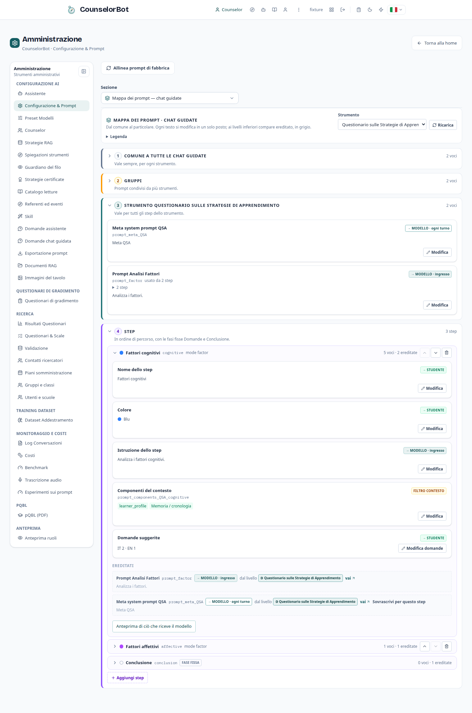
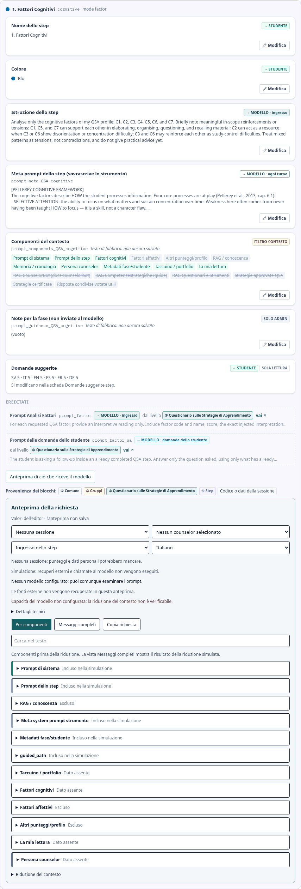
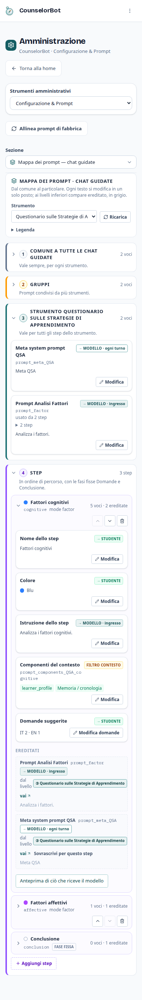
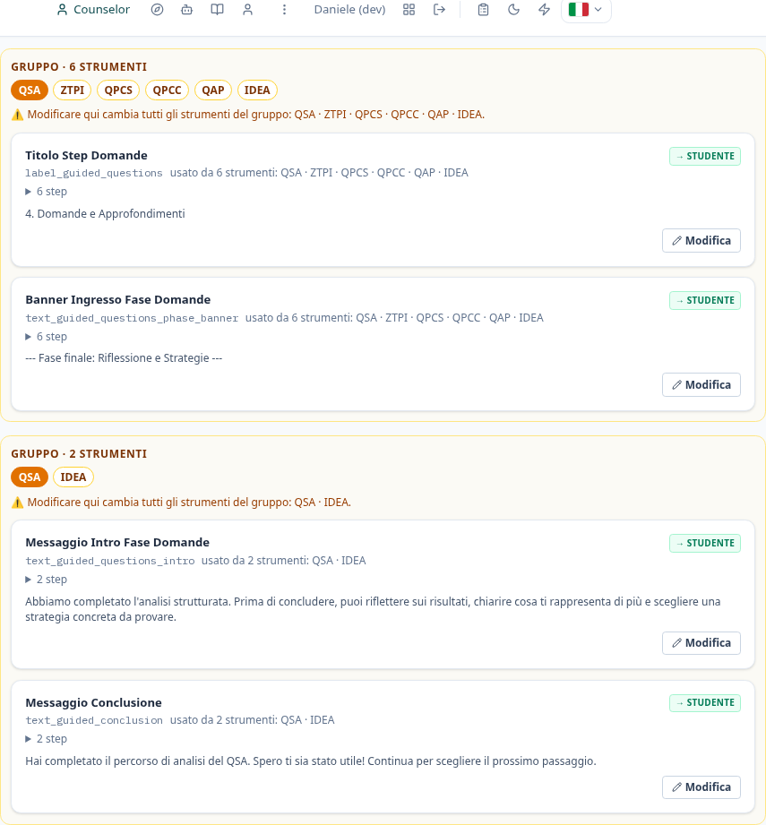
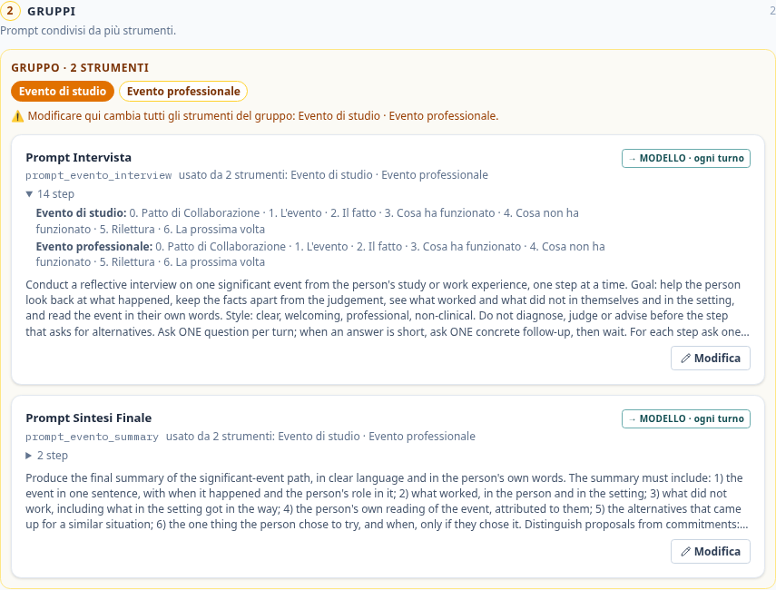

# Mappa dei prompt delle chat guidate (admin)

Vista di *Amministrazione → Configurazione → Mappa dei prompt*: i testi delle chat
guidate di uno strumento, **dal comune al particolare**, modificabili sul posto.
Opzione B dell'audit `docs/audits/2026-10-05-admin-prompt-sections.md`.

## Regole

- Ogni testo si **modifica in un solo posto**, al livello a cui appartiene. Ai
  livelli inferiori compare **ereditato**, in grigio, con link al livello giusto.
- Il livello si calcola dai dati (`backend/prompt_map.py`): una chiave usata da
  tutti gli strumenti è *comune*, da più strumenti è di *gruppo*, da più step
  dello stesso strumento (o propria dello strumento: meta prompt, prompt delle
  domande dello studente, testi di fase) è di *strumento*, altrimenti di *step*.
  Il frontend non ha liste di chiavi.
- Badge di destinazione su ogni voce: `→ MODELLO · ingresso`, `→ MODELLO · ogni
  turno`, `→ MODELLO · domande dello studente`, `→ STUDENTE`, `SOLO ADMIN`,
  `FILTRO CONTESTO`.
- Salvataggi solo tramite le API esistenti, che scrivono `prompt_revisions`:
  `POST /admin/config`, `PUT /admin/guided-steps/{id}`, `PUT /admin/counselors/{id}`.
- Livello 2: un riquadro per ogni insieme distinto di strumenti
  (`levels.groups[].instruments`, calcolato dal backend). L'intestazione elenca
  gli strumenti per titolo breve (`q.<id>.name`, altrimenti l'id; nome esteso nel
  `title`), evidenzia lo strumento scelto (`aria-current`) e l'avviso li cita per
  nome. Nessuna lista di strumenti nel frontend.
- "Usato da" di una voce condivisa: nomi degli strumenti in chiaro e, nel
  dettaglio «N step», gli step di ciascuno (`used_by.steps[]` con `label_i18n` e
  `fixed` per le fasi Domande/Conclusione).
- Prima di salvare una voce di livello 2 o usata da più step: avviso con l'elenco
  di chi la usa (strumenti per nome e numero di step) e conferma esplicita.
- La persona del counselor è di sola lettura qui: "Modifica" apre un popup che
  usa la stessa API del tab Counselor (nessuna seconda fonte).
- Le quattro schede storiche restano nella sezione *Strumenti — vista classica*
  (stessi id di `?section=`).

URL: `/admin?section=prompt-map&instrument=QSA` (l'id `prompt-map` è nuovo; gli
id esistenti di `?section=` non cambiano).

## Prototipo desktop (1440 px)

```
Configurazione
Sezione [ Mappa dei prompt ▾ ]   (Impostazioni: Mappa dei prompt · Generale · Direttive
                                   Strumenti — vista classica: QSA · QSAr · …)
┌──────────────────────────────────────────────────────────────────────────────────────┐
│ MAPPA DEI PROMPT · CHAT GUIDATE                    Strumento [ QSA ▾ ]  ↻ Ricarica   │
│ Dal comune al particolare. Ogni testo si modifica in un solo posto; più in basso      │
│ compare ereditato.                                                                    │
│ Legenda  [→ MODELLO · ingresso] [→ MODELLO · ogni turno] [→ MODELLO · domande stud.]  │
│          [→ STUDENTE] [SOLO ADMIN] [FILTRO CONTESTO]                                  │
├──────────────────────┬───────────────────────────────────────────────────────────────┤
│ LIVELLI (sticky)     │ ① COMUNE A TUTTE LE CHAT GUIDATE · vale sempre        9 voci  │
│ ① Comune         9   │ ┌───────────────────────────────────────────────────────────┐ │
│ ② Gruppi         4   │ │ Persona del counselor    [→ MODELLO · ogni turno] SOLA LETT.│ │
│ ③ Strumento QSA  4   │ │  Sofia   «Sei Sofia, una counselor…»            [Modifica ⧉] │ │
│ ④ Step          12   │ │  Marco   «…»                                     [Modifica ⧉] │ │
│   0 Presentazione    │ ├───────────────────────────────────────────────────────────┤ │
│   1 Fattori cogn.    │ │ Direttiva qualità conversazione [→ MODELLO · ogni turno]  │ │
│   2 Fattori aff.     │ │ directive_conversation_quality · 12 strumenti             │ │
│   …                  │ │ «[ORIENTATION] Begin with the specific…» (2 righe)        │ │
│   Domande (fissa)    │ │                                   [Storico] [Modifica]    │ │
│   Conclusione (fissa)│ └───────────────────────────────────────────────────────────┘ │
│                      │   … altre 5 direttive, prompt fase Domande, titolo Conclusione│
│                      │                                                               │
│                      │ ② GRUPPI · prompt condivisi da più strumenti                  │
│                      │ ┌ GRUPPO · 6 STRUMENTI ─────────────────────────────────────┐ │
│                      │ │ [■QSA] [ZTPI] [QPCS] [QPCC] [QAP] [IDEA]  (■ = scelto)    │ │
│                      │ │ ⚠ Modificare qui cambia tutti gli strumenti del gruppo:   │ │
│                      │ │   QSA · ZTPI · QPCS · QPCC · QAP · IDEA.                   │ │
│                      │ │ Titolo fase Domande          [→ STUDENTE]  6 lingue        │ │
│                      │ │   usato da 6 strumenti: QSA · ZTPI · … ▸ 6 step            │ │
│                      │ │ Banner fase Domande          [→ STUDENTE]                  │ │
│                      │ └───────────────────────────────────────────────────────────┘ │
│                      │ ┌ GRUPPO · 2 STRUMENTI ─ [■QSA] [IDEA] ─────────────────────┐ │
│                      │ │ ⚠ … del gruppo: QSA · IDEA.  Testo intro · Conclusione    │ │
│                      │ └───────────────────────────────────────────────────────────┘ │
│                      │                                                               │
│                      │ ③ STRUMENTO QSA · vale per tutti i suoi step                  │
│                      │   Meta prompt dello strumento     [→ MODELLO · ogni turno]    │
│                      │   Prompt analisi fattori          [→ MODELLO · ingresso]      │
│                      │     prompt_factor · usato da 2 step: Cognitivi, Affettivi     │
│                      │   Prompt domande dello studente   [→ MODELLO · domande stud.] │
│                      │     prompt_factor_qa · usato da 9 step                        │
│                      │   Prompt secondo livello          [→ MODELLO · ingresso] 7 st.│
│                      │                                                               │
│                      │ ④ STEP  (in ordine di percorso)                               │
│                      │ ┌ 1 · Fattori cognitivi ● blu · mode factor ────────────────┐ │
│                      │ │ Nome dello step      [→ STUDENTE] it·en·es·fr·de·sv [Mod.]│ │
│                      │ │ Colore               [→ STUDENTE] ● blu            [Mod.] │ │
│                      │ │ Istruzione dello step[→ MODELLO · ingresso]        [Mod.] │ │
│                      │ │ Meta prompt dello step (sovrascrive ③) [→ MODELLO] [Mod.] │ │
│                      │ │ Componenti del contesto [FILTRO CONTESTO] ☑ ☑ ☐ …  [Mod.] │ │
│                      │ │ Note per la fase     [SOLO ADMIN]                  [Mod.] │ │
│                      │ │ Domande suggerite    [→ STUDENTE] it 3 · en 3 · …         │ │
│                      │ │ ░ Ereditati ░░░░░░░░░░░░░░░░░░░░░░░░░░░░░░░░░░░░░░░░░░░░░ │ │
│                      │ │ ░ Prompt di sistema · prompt_factor     ③ Strumento → vai │ │
│                      │ │ ░ Domande dello studente · prompt_factor_qa ③ → vai       │ │
│                      │ │ [▸ Anteprima di ciò che riceve il modello]                │ │
│                      │ └───────────────────────────────────────────────────────────┘ │
│                      │ ┌ Domande · fase fissa ─────────────────────────────────────┐ │
│                      │ │ ░ Prompt fase Domande · prompt_guided_questions ① → vai   │ │
│                      │ │ ░ Testo introduttivo · text_guided_questions_intro ② → vai│ │
│                      │ └───────────────────────────────────────────────────────────┘ │
└──────────────────────┴───────────────────────────────────────────────────────────────┘
```

### Modifica di una voce

```
┌ Prompt evento – intervista  [→ MODELLO · ogni turno]  prompt_evento_interview ────────┐
│ ┌───────────────────────────────────────────────────────────────────────────────────┐ │
│ │ textarea (testo corrente)                                                         │ │
│ └───────────────────────────────────────────────────────────────────────────────────┘ │
│ ⚠ Condiviso: Evento studio · Evento professionale (16 step). Il salvataggio vale per  │
│   tutti.                              [Annulla] [Salva per tutti]                     │
└───────────────────────────────────────────────────────────────────────────────────────┘
Testi per lo studente: schede lingua [it] [en] [es] [fr] [de] [sv] sopra la textarea
(it = valore base; le altre salvano <chiave>__<lingua>, come "Testi interfaccia").
```

### Popup persona del counselor

```
┌──────────── Persona del counselor · Sofia ─────────────── ✕ ┐
│ Il testo vive nel tab Counselor; qui lo modifichi con la    │
│ stessa API (PUT /admin/counselors/{id}).                    │
│ ┌─────────────────────────────────────────────────────────┐ │
│ │ textarea                                                │ │
│ └─────────────────────────────────────────────────────────┘ │
│ [Storico revisioni ▸]                     [Annulla] [Salva] │
└─────────────────────────────────────────────────────────────┘
```

## Prototipo mobile (390 px)

```
┌──────────────────────────────┐
│ Sezione [Mappa dei prompt ▾] │
│ MAPPA DEI PROMPT             │
│ Strumento [ QSA          ▾ ] │
│ ▸ Legenda (chiusa)           │
├──────────────────────────────┤
│ [①Comune][②Gruppi][③QSA][④Step]  ← barra sticky, scorre in orizzontale
├──────────────────────────────┤
│ ① COMUNE           9 voci    │
│ ┌──────────────────────────┐ │
│ │ Persona del counselor    │ │
│ │ [→ MODELLO·ogni turno]   │ │
│ │ [SOLA LETTURA]           │ │
│ │ Sofia «Sei Sofia…»       │ │
│ │              [Modifica ⧉]│ │
│ └──────────────────────────┘ │
│ ┌──────────────────────────┐ │
│ │ Direttiva qualità conv.  │ │
│ │ [→ MODELLO·ogni turno]   │ │
│ │ «[ORIENTATION] Begin…»   │ │
│ │ [Storico]     [Modifica] │ │
│ └──────────────────────────┘ │
│ …                            │
│ ④ STEP                       │
│ Step [1 · Fattori cognit. ▾] │  ← select al posto della colonna sinistra
│ ┌──────────────────────────┐ │
│ │ Nome dello step          │ │
│ │ [→ STUDENTE]   [Modifica]│ │
│ │ …                        │ │
│ │ ░ prompt_factor  ③ → vai │ │
│ └──────────────────────────┘ │
└──────────────────────────────┘
Badge e pulsanti vanno a capo; textarea a tutta larghezza; nessuno scroll orizzontale
della pagina (solo la barra dei livelli).
```

## Schermate (ambiente dev, DB `counselorbot_test`)











Colori dei livelli: ① comune grigio, ② gruppi ocra, ③ strumento petrolio, ④ step
viola; nell'anteprima il bordo sinistro di ogni blocco indica il livello da cui
proviene il testo (grigio pieno: codice o dati della sessione).

## Sviluppo e verifica

- Backend: `GET /admin/prompt-map/instruments`, `GET /admin/prompt-map?instrument=<id>`
  (`backend/prompt_map.py`, test `backend/tests/test_admin_prompt_map.py`).
- Frontend: `frontend/src/components/admin/PromptMap.tsx`, i18n in
  `frontend/src/lib/i18n-prompt-map.ts`, test browser
  `frontend/tests/admin-prompt-map.test.mjs` (API intercettate, ambiente dev su 3107).
- Ambiente dev: `docs/operations/live-dev-environment.md`.
