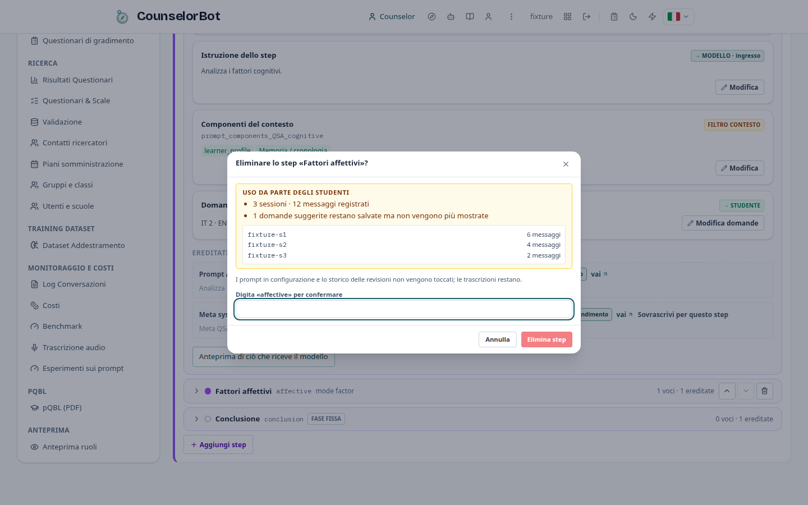
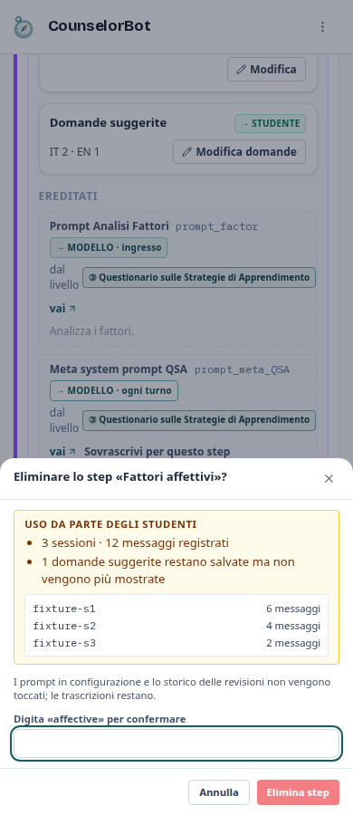

# Mappa dei prompt delle chat guidate (admin)

Vista di *Amministrazione → Configurazione → Mappa dei prompt*: i testi delle chat
guidate di uno strumento, **dal comune al particolare**, modificabili sul posto.
Opzione B dell'audit `docs/audits/2026-10-05-admin-prompt-sections.md`.

Dal 5 ottobre, testi e bozze mostrano i token stimati. Ogni istruzione del
modello ha i pulsanti Totale, Ristretto e Minimo: selezione → Modifica → Salva
nel database, con testi indipendenti e storico. Vale anche per direttive, meta,
step, varianti Idea e persona del counselor. Vuoto significa ereditare Totale.
L'anteprima sceglie un preset attivo e mostra token per blocco, totale e budget.
Livelli/assegnazioni manuali si gestiscono in Generale: [procedura](model-context-levels.md)
e [risultati CR1–CR4](model-context-levels-validation.md).

## Regole

- Ogni testo si **modifica in un solo posto**, al livello a cui appartiene. Ai
  livelli inferiori compare **ereditato**, in grigio, con link al livello giusto.
- Il livello si calcola dai dati (`backend/prompt_map.py`): una chiave usata da
  tutti gli strumenti è *comune*, da più strumenti è di *gruppo*, da più step
  dello stesso strumento (o propria dello strumento: meta prompt, prompt delle
  domande dello studente, testi di fase) è di *strumento*, altrimenti di *step*.
  Il frontend non ha liste di chiavi.
- Badge di destinazione su ogni voce: `→ MODELLO · ingresso`, `→ MODELLO · ogni
  turno`, `→ MODELLO · domande dello studente`, `→ STUDENTE`, `SOLO ADMIN`,
  `FILTRO CONTESTO`.
- Salvataggi solo tramite le API esistenti, che scrivono `prompt_revisions`:
  `POST /admin/config`, `PUT /admin/guided-steps/{id}`, `PUT /admin/counselors/{id}`.
- Livello 2: un riquadro per ogni insieme distinto di strumenti
  (`levels.groups[].instruments`, calcolato dal backend). L'intestazione elenca
  gli strumenti per titolo breve (`q.<id>.name`, altrimenti l'id; nome esteso nel
  `title`), evidenzia lo strumento scelto (`aria-current`) e l'avviso li cita per
  nome. Nessuna lista di strumenti nel frontend.
- "Usato da" di una voce condivisa: nomi degli strumenti in chiaro e, nel
  dettaglio «N step», gli step di ciascuno (`used_by.steps[]` con `label_i18n` e
  `fixed` per le fasi Domande/Conclusione).
- Prima di salvare una voce di livello 2 o usata da più step: avviso con l'elenco
  di chi la usa (strumenti per nome e numero di step) e conferma esplicita.
- La persona del counselor è di sola lettura qui: "Modifica" apre un popup che
  usa la stessa API del tab Counselor per Totale; Ristretto e Minimo usano
  righe Config separate, con il proprio storico.
- Le quattro schede storiche restano nella sezione *Strumenti — vista classica*
  (stessi id di `?section=`).

URL: `/admin?section=prompt-map&instrument=QSA` (l'id `prompt-map` è nuovo; gli
id esistenti di `?section=` non cambiano).

## Struttura corrente (desktop e mobile)

```text
MAPPA DEI PROMPT                 Strumento [QSA v] [Ricarica]
  > 1 Comune a tutte le chat guidate · N voci
  > 2 Gruppi · N voci
  v 3 Strumento · QSA · N voci
      testi propri dello strumento
  v 4 Step · N step
      v Fattori cognitivi                         [su][giu][elimina]
          Nome · Colore · Istruzione
          Componenti del contesto
          Altri testi dello step · Note · Domande suggerite [Modifica domande]
          Ereditati [vai] · Anteprima
      > Fattori affettivi                         [su][giu][elimina]
      > Domande (fissa)
      > Conclusione (fissa)
      [Aggiungi step]
```

Comune e Gruppi partono chiusi, Strumento e Step aperti; è espanso soltanto il
primo step. Lo stato viene ricordato nel `localStorage` del browser (step distinti
per strumento). I riferimenti «vai» espandono il livello e lo step di destinazione
prima di scorrere alla voce. Non esistono più la colonna sinistra, la barra mobile
dei livelli o il selettore dello step. I componenti del contesto sono subito dopo
nome, colore e istruzione.

### Domande suggerite nel popup

```text
Domande suggerite · Fattori cognitivi                    [chiudi]
  [IT 2] [EN 1] [ES 0] [FR 0] [DE 0] [SV 0]
  domanda 1                  [su][giu][modifica][elimina]
  domanda 2                  [su][giu][modifica][elimina]
  Nuova domanda [____________________] [Aggiungi]
                                                       [Chiudi]
```

Il popup usa `GET/POST /admin/guided-step-questions` e `PUT/DELETE
/admin/guided-step-questions/{id}`; filtra per strumento, step e lingua. La
modifica e l'aggiunta salvano solo sul comando esplicito; l'eliminazione richiede
una seconda conferma. Cambiare lingua o chiudere con una bozza chiede conferma.
Il riordino aggiorna soltanto le posizioni cambiate. La scheda classica usa gli
stessi dati; non si creano copie dei testi.

### Aggiunta, spostamento, eliminazione di step

```text
Nuovo step
  Id [________] Nome [________] Tipo [generic v] Posizione [In fondo v]
  Istruzione [____________________________________________________]
                                                   [Annulla] [Crea step]

Eliminare lo step «Fattori affettivi»?                    [chiudi]
  Uso da parte degli studenti: 3 sessioni · 12 messaggi registrati
  fixture-s1                                             6 messaggi
  fixture-s2                                             4 messaggi
  fixture-s3                                             2 messaggi
  Le configurazioni dei prompt, le revisioni e le trascrizioni restano.
  Digita «affective» per confermare [________________]
                                                [Annulla] [Elimina step]
```

- Aggiunta: `POST /admin/guided-steps`; identificativo normalizzato in minuscole,
  cifre e trattini, univoco globalmente; nome obbligatorio, istruzione facoltativa,
  modalità dall'API `/admin/guided-steps/modes`. Crea in fondo, poi riordina se si
  sceglie «Prima di». Se il secondo comando fallisce, lo step creato resta e un
  avviso persistente invita a usare le frecce: non viene proposta una seconda
  creazione dello stesso step.
- Spostamento: `PATCH /admin/guided-steps/reorder`, una richiesta con le sole
  posizioni cambiate, limitata agli step mobili dello strumento visualizzato. Su
  mobile i comandi hanno una riga dedicata sotto il titolo e il conteggio.
- Eliminazione: prima `GET /admin/guided-steps/{id}/usage`, protetto per gli admin,
  restituisce conteggio delle sessioni distinte, messaggi, domande suggerite e
  `session_details[]` (`session_id`, `messages`). L'uso deriva dai log conservati
  con lo stesso strumento e fase; non è un censimento delle sessioni senza log
  o già eliminate dalla retention. Nel popup sono visibili solo identificativi
  e conteggi, senza testo delle conversazioni o dati anagrafici. La conferma
  richiede l'id esatto, poi `DELETE /admin/guided-steps/{id}`. Se la lettura
  dell'uso fallisce non è possibile confermare. Un errore di eliminazione conserva
  il popup e permette di riprovare. Durante l'eliminazione la chiusura è bloccata.
- Le fasi fisse Domande/Conclusione non hanno comandi strutturali. Dalla mappa
  l'ultimo step mobile non è eliminabile. La cancellazione rimuove solo la riga
  `GuidedStep`: configurazioni dei prompt, revisioni, trascrizioni e domande
  suggerite restano conservate. Le domande non sono più proposte nello step
  rimosso. Nessuno script aggiorna i prompt già salvati nel database.

## Schermate correnti (fixture browser senza DB)






La guida pubblica studente/docente non descrive le funzioni di amministrazione;
per questo cambiamento non richiede aggiornamenti alle sei versioni o alle loro
schermate. Le nuove stringhe del pannello admin sono presenti nelle sei lingue.

## Sviluppo e verifica

- Backend: `GET /admin/prompt-map/instruments`, `GET /admin/prompt-map?instrument=<id>`
  (`backend/prompt_map.py`, test `backend/tests/test_admin_prompt_map.py`).
- Struttura e conferma: `backend/tests/test_admin_guided_step_structure.py`,
  su PostgreSQL effimero dedicato, mai sul DB operativo.
- Frontend: `frontend/src/components/admin/PromptMap.tsx`, i18n in
  `frontend/src/lib/i18n-prompt-map.ts`, test browser
  `frontend/tests/admin-prompt-map.test.mjs` (API intercettate, ambiente dev su 3107).
- Ambiente dev: `docs/operations/live-dev-environment.md`.

Per riprodurre le catture con dati fittizi, da `frontend/`:

```bash
PROMPT_MAP_BASE_URL=http://127.0.0.1:3107 \
PROMPT_MAP_SCREENSHOT_DIR=../docs/operations/img \
node --test tests/admin-prompt-map.test.mjs
```

Le fixture intercettano tutte le API; verificano ordine, richieste di salvataggio,
bozze delle domande, conferma ed errori, senza scrivere dati operativi. Le immagini
con gruppi e anteprima ancora nel repository sono catture storiche della versione
precedente e non documentano il nuovo layout.

## Verifica del 5 ottobre 2026 (S25)

- Branch mantenuto: `feature/prompt-map-step-editing`; PR [#52](https://github.com/nugh75/counselorbot-sbs/pull/52).
- Backend: **17 test passati** nell'immagine locale ricostruita, su PostgreSQL 15
  effimero dedicato (solo loopback `18498`, dati sintetici, nessun volume operativo).
  Coprono uso per strumento/fase, elenco e conteggi, accesso negato allo studente,
  aggiunta/riordino e conservazione di configurazioni, revisioni, log e domande
  dopo l'eliminazione.
- Frontend: **264 test unitari passati**, **16 test browser passati** contro
  l'immagine ricostruita su loopback `3155`, con tutte le API simulate. Desktop
  1440 px e mobile 390 px, sezioni ricordate, contesto al quarto posto,
  CRUD domande, ordine/creazione, conferma per id, errore di lettura dell'uso,
  errore di cancellazione e posizionamento fallito dopo creazione riuscita.
- i18n delle sei lingue, TypeScript e ESLint dei file modificati: passati.
  `npm run lint` globale: **1 errore preesistente** in
  `frontend/src/components/visual/NewDeckDialog.tsx:36`
  (`react-hooks/set-state-in-effect`) e 44 warning. Il file è stato confrontato
  byte per byte con `HEAD` e risulta identico. Bug già presente nel Diario:
  `2a50c13c-0ad7-4f41-b3ab-01f56888de76`.
- Immagini locali: `counselorbot-s25-frontend-check:20261005` e
  `counselorbot-s25-backend-check:20261005`; build complete e test eseguiti sul
  loro codice. Non costituiscono un rilascio in produzione. I container di prova
  vengono fermati e rimossi a fine verifica; le immagini restano disponibili.
- Nessuna modifica a prompt/configurazioni DB operativi, `.env`, proxy o servizi
  di produzione. Il dev preesistente del worktree su `3107` resta attivo; si ferma
  con `Ctrl+C` nel terminale che lo ha avviato. I test non usano il suo backend.
- Screenshot aggiornati con dati fittizi. La guida pubblica studente/docente è
  stata riesaminata e non contiene questa superficie admin; manifest aggiornato
  con `make guidance-refresh`, controllo `make guidance-check` passato.
