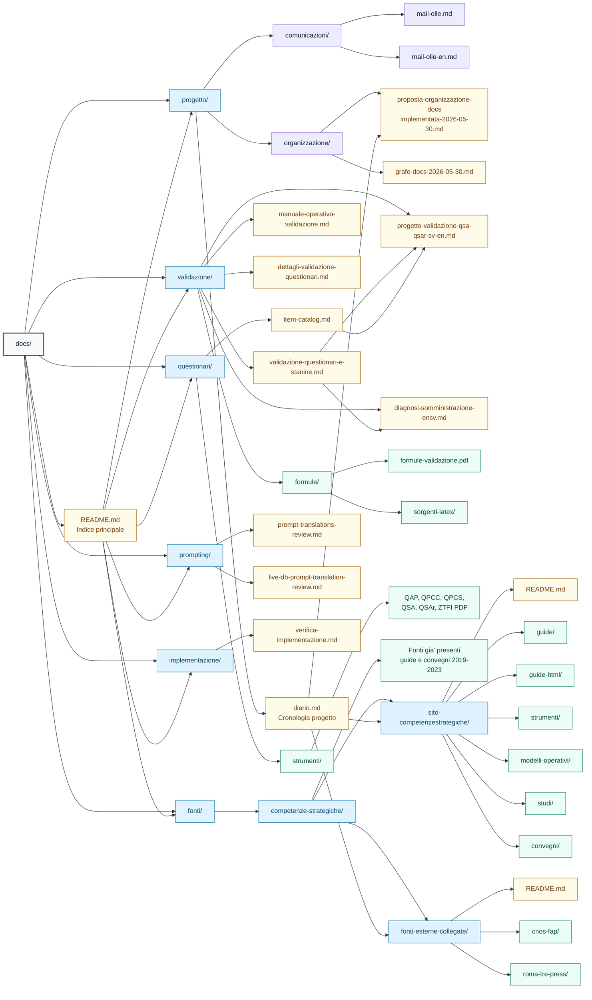

# Grafo della documentazione

Grafo aggiornato al 2026-05-30. Rappresenta la struttura canonica della cartella `docs/` dopo la migrazione e lo scarico delle fonti pubbliche da `competenzestrategiche.it`.

## Nota su grafifyy

La skill `grafifyy` non risulta installata o raggiungibile nella sessione corrente. Questo grafo e' quindi generato come Mermaid Markdown, formato semplice da versionare e convertibile in SVG/PNG con strumenti locali o editor compatibili.
